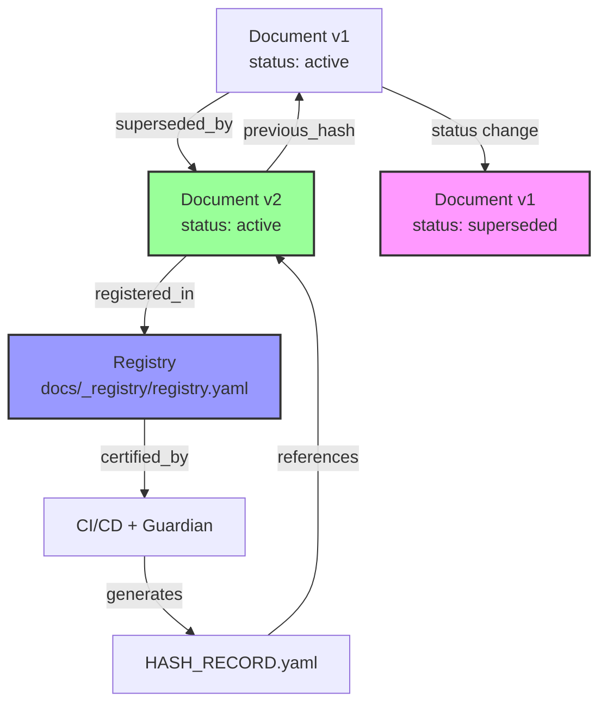
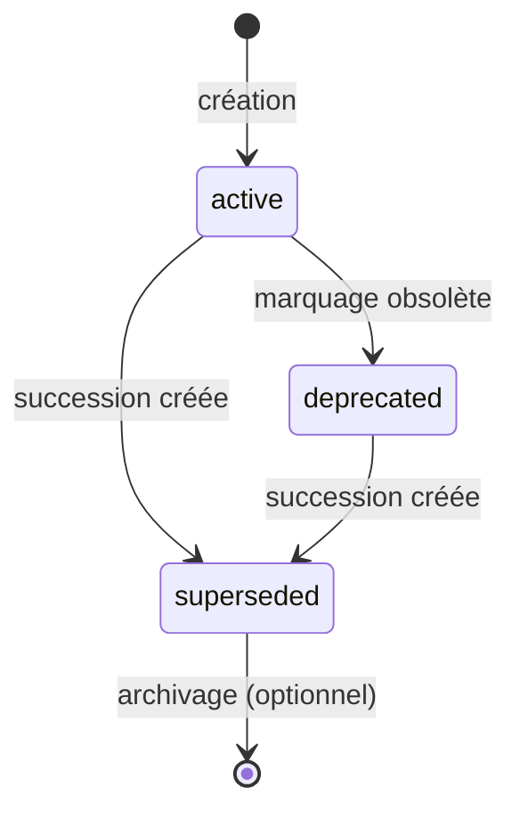
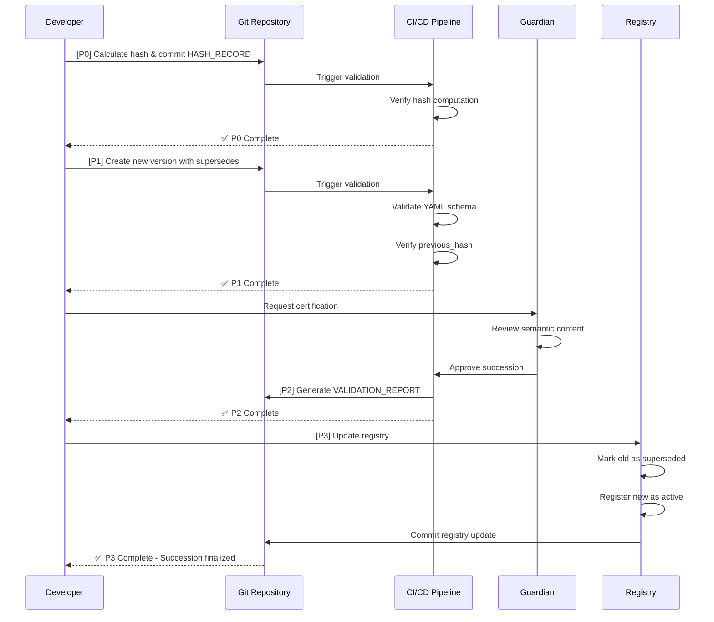
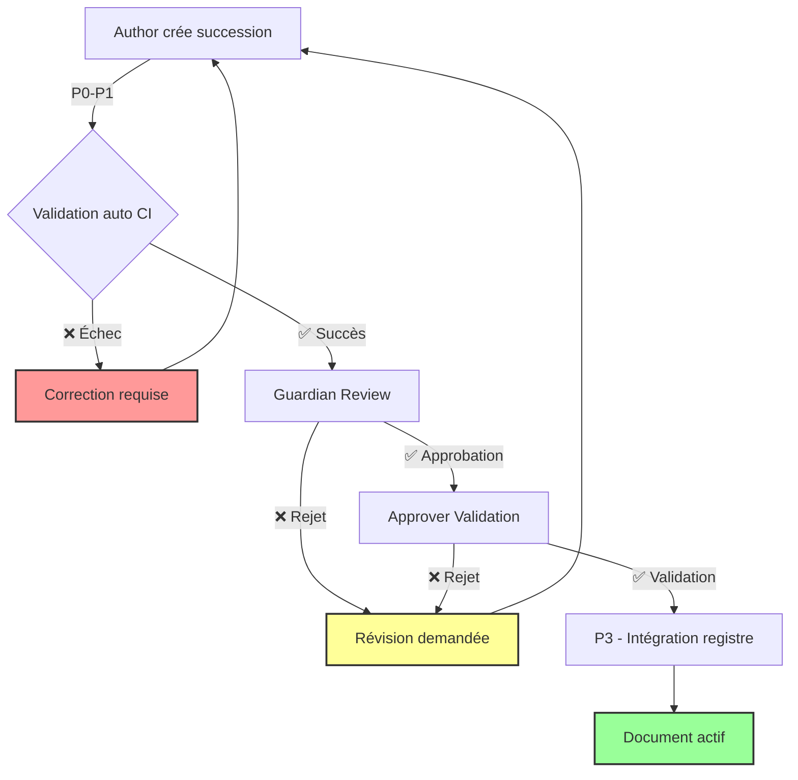

# RFC-004 : Protocole de mise en cohérence documentaire Relinium

## I. Contexte

### 1.1 État des lieux

L'audit **OBS-CONFORMITY-0001** a révélé un taux de conformité documentaire de **2,7%** par rapport au schéma SSOT v1.0. Sur 141 documents analysés, seuls 4 respectent pleinement les exigences de métadonnées, de structure et de traçabilité.

Cette situation critique ne résulte pas d'une négligence, mais de l'évolution organique du projet. Les documents ont été créés à différentes étapes de maturité, avant que le schéma normatif ne soit pleinement défini.

### 1.2 Besoin identifié

La restauration de la cohérence documentaire nécessite un **protocole de succession certifiée** permettant de :

- Corriger les non-conformités sans altérer l'intégrité des documents originaux
- Maintenir la traçabilité complète des évolutions documentaires
- Garantir la réversibilité de toute modification
- Établir une filiation certifiée entre versions successives

### 1.3 Objectif du RFC

Ce document définit le **protocole normatif complet** encadrant la mise en conformité du corpus Relinium avec les exigences SSOT v1.1. 

**Principe fondamental** : Dans Relinium, un document n'est jamais modifié. Il est **supplanté** par une nouvelle version qui hérite de son identité et conserve la trace cryptographique de son prédécesseur.

---

## II. Principes directeurs

### Principe 1 : Inviolabilité originelle

**Énoncé** : Tout document une fois créé devient immuable. Sa forme et son contenu à l'instant T constituent une vérité historique qui ne peut être effacée.

**Justification** : L'intégrité documentaire repose sur la capacité à retrouver l'état exact d'un document à tout moment. La modification directe détruit cette capacité et brise la chaîne de confiance.

**Exemple pratique** :
```yaml
# Document original (OBS-0007.md) - JAMAIS MODIFIÉ
---
id: "OBS-0007"
type: "observation"
date: "2024-12-15"
# ... métadonnées incomplètes
---
```

```yaml
# Nouvelle version (OBS-0007-v2.md) - CRÉÉE PAR SUCCESSION
---
id: "OBS-0007-v2"
type: "observation"
date: "2025-05-11"
supersedes: "OBS-0007"
previous_hash: "sha256:a1b2c3d4..."
# ... métadonnées complètes v1.1
---
```

**Contrainte CI** : Tout commit modifiant un fichier existant (au lieu de créer une version successive) doit être rejeté automatiquement.

### Principe 2 : Succession certifiée

**Énoncé** : Toute évolution documentaire se fait par création d'un nouveau document qui déclare explicitement son prédécesseur et en conserve l'empreinte cryptographique.

**Justification** : La succession certifiée établit une chaîne de preuve inaltérable, où chaque version atteste de l'authenticité de la précédente.

**Exemple pratique** :
```yaml
# Métadonnées de succession
supersedes: "RFC-001"           # ID du document remplacé
previous_hash: "sha256:e4f5g6..."  # Empreinte du contenu original
id_root: "RFC-001"              # Identifiant stable du fil documentaire
```

**Contrainte CI** : La CI vérifie que le hash déclaré correspond au contenu réel du document supplanté.

### Principe 3 : Continuité relationnelle

**Énoncé** : Les relations entre documents (citations, dépendances) doivent être préservées et mises à jour pour pointer vers les versions successives appropriées.

**Justification** : Un document ne vit pas isolément. Sa succession impacte l'écosystème documentaire qui doit rester cohérent.

**Exemple pratique** :
```yaml
# Document A cite B
links:
  cites: ["RFC-001-v2"]  # Mis à jour pour pointer vers la dernière version

# Document B est supplanté
links:
  superseded_by: "RFC-001-v2"  # Indique l'existence d'une version plus récente
```

**Contrainte CI** : Les citations vers des documents `deprecated` ou `superseded` génèrent un avertissement.

### Principe 4 : Horodatage intégral

**Énoncé** : Chaque événement du cycle de vie documentaire (création, succession, dépréciation) est horodaté en format ISO 8601 UTC.

**Justification** : L'horodatage permet de reconstituer l'histoire temporelle exacte du corpus documentaire.

**Exemple pratique** :
```yaml
date: "2025-05-11T20:30:00Z"
updated: "2025-05-11T22:15:00Z"
deprecated_at: "2025-05-12T08:00:00Z"
```

**Contrainte CI** : Les dates doivent être au format ISO 8601 et cohérentes (updated >= date, deprecated_at >= updated).

### Principe 5 : Traçabilité cryptographique

**Énoncé** : Chaque version documentaire possède une empreinte SHA256 unique qui permet de vérifier son intégrité à tout instant.

**Justification** : Le hash cryptographique constitue une preuve infalsifiable de non-altération du contenu.

**Exemple pratique** :
```yaml
# HASH_RECORD.yaml
record_id: "HR-2025-0001"
document_id: "RFC-001-v2"
hash: "sha256:9f8e7d6c..."
algorithm: "SHA256"
computed_at: "2025-05-11T20:30:00Z"
certified_by: "Guardian CI/CD"
```

**Contrainte CI** : Un script vérifie périodiquement que les hashs enregistrés correspondent au contenu actuel des fichiers.

### Principe 6 : Réversibilité

**Énoncé** : Toute succession documentaire peut être annulée en restaurant l'état précédent, sans perte d'information.

**Justification** : La réversibilité est une garantie de sécurité permettant de corriger les erreurs de succession.

**Exemple pratique** :
```bash
# Restauration du document original
git checkout <commit-hash> -- docs/path/to/OBS-0007.md

# Le registre garde la trace de la tentative de succession
registry:
  - id: "OBS-0007-v2"
    status: "reverted"
    reverted_at: "2025-05-11T23:00:00Z"
    reason: "Erreur dans les métadonnées de succession"
```

**Contrainte CI** : Le registre doit conserver l'historique complet, y compris les successions annulées.

### Principe 7 : Observabilité intégrale

**Énoncé** : Tout acteur du système (humain ou machine) doit pouvoir observer l'état complet du corpus documentaire et de ses successions.

**Justification** : La transparence totale permet la détection précoce des anomalies et renforce la confiance dans le système.

**Exemple pratique** :
```yaml
# Registre observable (registry.yaml)
documents:
  - id: "RFC-001-v2"
    type: "RFC"
    status: "active"
    supersedes: "RFC-001"
    created_at: "2025-05-11T20:30:00Z"
    certified_by: "Guardian"
    hash: "sha256:9f8e7d6c..."
```

**Contrainte CI** : Le registre doit être automatiquement mis à jour à chaque succession et disponible en lecture publique.

### Principe 8 : Équilibre humain/machine

**Énoncé** : Les processus de succession combinent validation automatique (CI/CD) et approbation humaine (Guardian/Approver).

**Justification** : La machine vérifie la conformité technique, l'humain valide la cohérence sémantique et l'intention.

**Exemple pratique** :
```yaml
# Workflow de validation
validation:
  automated:
    - hash_verification: "passed"
    - schema_validation: "passed"
    - link_integrity: "passed"
  human:
    - guardian_review: "approved"
      reviewer: "Greg Catteau"
      date: "2025-05-11T21:00:00Z"
    - approver_validation: "approved"
      approver: "Tech Lead"
      date: "2025-05-11T21:30:00Z"
```

**Contrainte CI** : Aucune succession n'est finalisée sans double validation (machine + humain).

---

## III. Schéma de cycle de vie documentaire

### 3.1 Graphe de succession



### 3.2 États du cycle de vie

| État | Description | Lisible | Modifiable | Citable |
|------|-------------|---------|------------|---------|
| **active** | Version courante, référence officielle | ✅ | ❌ (succession uniquement) | ✅ |
| **deprecated** | Version obsolète mais encore utilisable | ✅ | ❌ | ⚠️ (avec avertissement) |
| **superseded** | Version remplacée par une autre | ✅ | ❌ | ❌ (redirection automatique) |

### 3.3 Transitions d'état



**Règles de transition** :
- Un document `active` peut devenir `deprecated` ou `superseded`
- Un document `deprecated` peut devenir `superseded`
- Un document `superseded` ne peut plus changer d'état (terminal)
- Les transitions sont unidirectionnelles (pas de retour arrière)

---

## IV. Processus opérationnel d'alignement

### 4.1 Vue d'ensemble

Le processus de succession documentaire se décompose en 4 phases séquentielles obligatoires :

| Phase | Nom | Action | Livrables |
|-------|-----|--------|-----------|
| **P0** | Archivage | Hash + signature du document original | `AUDIT_LOG.md`, `HASH_RECORD.yaml` |
| **P1** | Réécriture | Nouveau document superseding créé | `*-v2.md` ou `*-vX.md` |
| **P2** | Certification | Validation CI/CD + signature Guardian | `VALIDATION_REPORT.md` |
| **P3** | Intégration | Ajout au registre central | `registry.yaml` mise à jour |

**Contrainte absolue** : Aucune phase ne peut être sautée. Toute tentative de bypass invalide la succession.

### 4.2 Phase P0 : Archivage

**Objectif** : Établir l'état de référence du document à supplanter.

**Actions** :
1. Calculer le hash SHA256 du document original
2. Enregistrer le hash dans `HASH_RECORD.yaml`
3. Créer une entrée dans `AUDIT_LOG.md`
4. Commit avec message normalisé : `[P0] Archive <document-id> for supersession`

**Livrables** :

```yaml
# HASH_RECORD.yaml
- record_id: "HR-2025-0015"
  document_id: "RFC-001"
  hash: "sha256:a1b2c3d4e5f6..."
  algorithm: "SHA256"
  computed_at: "2025-05-11T20:00:00Z"
  file_path: "docs/03-architecture/rfcs/RFC-001-choix-stack-initiale.md"
  file_size: 12450
  certified_by: "audit_verify_hashes.py"
  phase: "P0"
```

```markdown
# AUDIT_LOG.md
## 2025-05-11T20:00:00Z - P0 Archive RFC-001
- **Document** : RFC-001-choix-stack-initiale.md
- **Hash** : sha256:a1b2c3d4e5f6...
- **Raison** : Mise en conformité SSOT v1.1
- **Initié par** : Greg Catteau
```

**Critères de validation** :
- ✅ Hash calculé et enregistré
- ✅ Audit log mis à jour
- ✅ Commit signé et poussé

### 4.3 Phase P1 : Réécriture

**Objectif** : Créer la nouvelle version conforme du document.

**Actions** :
1. Créer un nouveau fichier avec suffixe `-v2` ou incrément approprié
2. Copier le contenu original et appliquer les corrections
3. Ajouter les métadonnées de succession (supersedes, previous_hash, id_root)
4. Commit avec message normalisé : `[P1] Create <document-id>-v2 superseding <document-id>`

**Exemple de succession** :

```yaml
# Fichier original : RFC-001-choix-stack-initiale.md
---
id: "RFC-001"
type: "RFC"
status: "accepted"
date: "2024-11-15"
# ... métadonnées incomplètes
---

# Nouvelle version : RFC-001-v2-choix-stack-initiale.md
---
id: "RFC-001-v2"
type: "RFC"
status: "accepted"
date: "2024-11-15"
updated: "2025-05-11"
author: "Greg Catteau"
version: "2.0.0"
supersedes: "RFC-001"
previous_hash: "sha256:a1b2c3d4e5f6..."
id_root: "RFC-001"
tags: ["architecture", "stack", "decision"]
links:
  cites: []
  supersedes: "RFC-001"
intent:
  primary_question: "Quelle stack technique initiale adopter pour Relinium ?"
---
```

**Critères de validation** :
- ✅ Nouveau fichier créé (pas de modification de l'original)
- ✅ Métadonnées de succession présentes et valides
- ✅ Hash déclaré correspond à l'original
- ✅ Contenu mis à jour et conforme SSOT v1.1

### 4.4 Phase P2 : Certification

**Objectif** : Valider techniquement et humainement la succession.

**Actions** :
1. Exécuter la validation CI/CD automatique
2. Demander la revue du Guardian
3. Générer le rapport de validation
4. Commit avec message normalisé : `[P2] Certify <document-id>-v2 succession`

**Validation automatique** :

```bash
# Script de validation
./scripts/validate_frontmatter.py --strict --file RFC-001-v2-choix-stack-initiale.md

# Vérifications effectuées :
# - Schéma YAML valide
# - Champs obligatoires présents
# - Hash previous_hash vérifié
# - Liens cohérents
# - Format ISO 8601 des dates
```

**Validation humaine** :

```yaml
# VALIDATION_REPORT.md
## Certification RFC-001-v2

### Validation automatique
- ✅ Schéma YAML : PASS
- ✅ Hash verification : PASS (matches sha256:a1b2c3d4e5f6...)
- ✅ Champs obligatoires : PASS
- ✅ Liens relationnels : PASS

### Revue Guardian
- **Reviewer** : Greg Catteau
- **Date** : 2025-05-11T21:00:00Z
- **Décision** : APPROVED
- **Commentaires** : 
  - Métadonnées complètes et conformes
  - Succession justifiée et documentée
  - Contenu sémantiquement identique avec corrections mineures

### Signature
- **Certified by** : Guardian CI/CD
- **Signature** : gpg-sign:ABC123...
```

**Critères de validation** :
- ✅ Tous les tests automatiques passent
- ✅ Revue Guardian approuvée
- ✅ Rapport de validation généré
- ✅ Signature cryptographique présente

### 4.5 Phase P3 : Intégration

**Objectif** : Enregistrer officiellement la succession dans le registre central.

**Actions** :
1. Mettre à jour `docs/_registry/registry.yaml`
2. Marquer l'ancien document comme `superseded`
3. Ajouter le nouveau document comme `active`
4. Commit avec message normalisé : `[P3] Integrate <document-id>-v2 into registry`

**Mise à jour du registre** :

```yaml
# registry.yaml (extrait)
documents:
  # Ancien document marqué superseded
  - id: "RFC-001"
    type: "RFC"
    path: "docs/03-architecture/rfcs/RFC-001-choix-stack-initiale.md"
    status: "superseded"
    created_at: "2024-11-15T10:00:00Z"
    superseded_by: "RFC-001-v2"
    superseded_at: "2025-05-11T22:00:00Z"
    hash: "sha256:a1b2c3d4e5f6..."
    
  # Nouveau document actif
  - id: "RFC-001-v2"
    type: "RFC"
    path: "docs/03-architecture/rfcs/RFC-001-v2-choix-stack-initiale.md"
    status: "active"
    created_at: "2025-05-11T20:30:00Z"
    updated_at: "2025-05-11T22:00:00Z"
    supersedes: "RFC-001"
    previous_hash: "sha256:a1b2c3d4e5f6..."
    id_root: "RFC-001"
    hash: "sha256:9f8e7d6c5b4a..."
    certified_by: "Guardian"
    certified_at: "2025-05-11T21:00:00Z"
```

**Critères de validation** :
- ✅ Registre mis à jour avec les deux entrées
- ✅ Statuts cohérents (old=superseded, new=active)
- ✅ Liens de succession bidirectionnels
- ✅ Hashs enregistrés

### 4.6 Workflow complet



---

## V. Métadonnées étendues (v1.1)

### 5.1 Nouveaux champs de succession

| Champ | Type | Description | Statut | Validation |
|-------|------|-------------|--------|------------|
| `supersedes` | string | ID du document remplacé | **Requis** si succession | Doit exister dans le corpus |
| `superseded_by` | string | ID du document suivant (rétrolien) | Optionnel | Ajouté automatiquement en P3 |
| `previous_hash` | string | Hash SHA256 du document précédent | **Requis** si succession | Doit matcher le hash réel |
| `id_root` | string | Identifiant stable du fil documentaire | Recommandé | Format: ID du document original |
| `scope` | enum | Domaine d'application | Optionnel | Valeurs: `project`, `team`, `organization`, `public` |
| `pattern` | enum | Nature du document | Optionnel | Valeurs: `decision`, `reflection`, `rule`, `observation`, `protocol` |
| `lifecycle_stage` | enum | Étape du cycle de vie | Recommandé | Valeurs: `draft`, `review`, `active`, `deprecated`, `superseded` |

### 5.2 Exemple complet de succession

```yaml
---
# === Identification ===
id: "OBS-CONFORMITY-0001-v2"
id_root: "OBS-CONFORMITY-0001"
type: "observation"

# === Succession ===
supersedes: "OBS-CONFORMITY-0001"
previous_hash: "sha256:abc123def456..."
lifecycle_stage: "active"

# === Métadonnées temporelles ===
date: "2025-05-10"
updated: "2025-05-11"
version: "2.0.0"

# === Métadonnées sémantiques ===
author: "Greg Catteau"
status: "En discussion"
scope: "project"
pattern: "observation"
tags: ["conformity", "audit", "SSOT", "alignment"]

# === Relations ===
links:
  cites: ["OBS-SCHEMA-0001", "SSOT_V1_CERTIFICATION"]
  supersedes: "OBS-CONFORMITY-0001"
  cited_by: []

# === Intention ===
intent:
  primary_question: "Quel est le niveau de conformité actuel du corpus documentaire Relinium ?"
  context: "Mise en conformité SSOT v1.1"
  expected_outcome: "Audit complet avec plan de mise en conformité"

# === Certification ===
certification:
  guardian_approval: true
  guardian: "Greg Catteau"
  certified_at: "2025-05-11T21:00:00Z"
  validation_hash: "sha256:fed321cba987..."
---
```

### 5.3 Validation CI des métadonnées

La CI doit vérifier la cohérence croisée des métadonnées de succession :

```python
# Pseudo-code de validation
def validate_succession_metadata(document):
    # Vérification 1 : Si supersedes existe, previous_hash est requis
    if document.supersedes and not document.previous_hash:
        raise ValidationError("previous_hash required when supersedes is set")
    
    # Vérification 2 : Le hash déclaré correspond au document supplanté
    if document.previous_hash:
        original = load_document(document.supersedes)
        computed_hash = compute_sha256(original)
        if computed_hash != document.previous_hash:
            raise ValidationError("previous_hash mismatch")
    
    # Vérification 3 : id_root cohérent
    if document.supersedes and document.id_root:
        original = load_document(document.supersedes)
        if original.id_root != document.id_root:
            raise ValidationError("id_root must match across succession chain")
    
    # Vérification 4 : Cycle de vie cohérent
    if document.lifecycle_stage == "superseded" and not document.superseded_by:
        raise ValidationError("superseded documents must declare superseded_by")
```

---

## VI. Gouvernance et rôles

### 6.1 Définition des rôles

| Rôle | Responsabilité | Preuve | Autorité |
|------|----------------|--------|----------|
| **Author** | Produit le nouveau document | Signature commit Git | Créer des successions |
| **Guardian** | Vérifie conformité technique et sémantique | Rapport de validation + signature | Approuver/rejeter successions |
| **Approver** | Valide la succession dans le registre | Commit de mise à jour registre | Finaliser l'intégration |

### 6.2 Workflow de validation



### 6.3 Matrice de décision

| Situation | Author | Guardian | Approver | Résultat |
|-----------|--------|----------|----------|----------|
| CI échoue | ❌ | - | - | ❌ Succession bloquée |
| CI passe, Guardian rejette | ✅ | ❌ | - | ❌ Révision nécessaire |
| CI passe, Guardian approuve, Approver rejette | ✅ | ✅ | ❌ | ❌ Révision nécessaire |
| CI passe, Guardian approuve, Approver valide | ✅ | ✅ | ✅ | ✅ Succession finalisée |

**Règle absolue** : Aucun document n'est actif sans triple validation (CI + Guardian + Approver).

### 6.4 Traçabilité des décisions

Chaque décision de validation doit être enregistrée :

```yaml
# SUCCESSION_DECISION_LOG.yaml
- succession_id: "RFC-001-v2"
  author: "Greg Catteau"
  date_submitted: "2025-05-11T20:30:00Z"
  
  validations:
    - role: "CI/CD"
      decision: "approved"
      date: "2025-05-11T20:35:00Z"
      checks:
        - schema_validation: "pass"
        - hash_verification: "pass"
        - link_integrity: "pass"
    
    - role: "Guardian"
      decision: "approved"
      reviewer: "Greg Catteau"
      date: "2025-05-11T21:00:00Z"
      comments: "Succession conforme et justifiée"
    
    - role: "Approver"
      decision: "approved"
      approver: "Tech Lead"
      date: "2025-05-11T21:30:00Z"
      registry_commit: "abc123"
  
  final_status: "integrated"
  integrated_at: "2025-05-11T22:00:00Z"
```

---

## VII. Preuves cryptographiques et registre

### 7.1 Calcul des empreintes

Chaque succession produit trois hashs distincts :

1. **Hash du document original** : Empreinte du contenu avant succession
2. **Hash du document successeur** : Empreinte du nouveau contenu
3. **Hash de validation** : Empreinte du processus de certification

```bash
# Calcul du hash (SHA256)
sha256sum docs/03-architecture/rfcs/RFC-001-choix-stack-initiale.md
# Output: a1b2c3d4e5f6789... RFC-001-choix-stack-initiale.md
```

### 7.2 Format du HASH_RECORD.yaml

```yaml
# HASH_RECORD.yaml
hash_records:
  - record_id: "HR-2025-0015"
    type: "succession"
    
    # Document original
    original:
      document_id: "RFC-001"
      path: "docs/03-architecture/rfcs/RFC-001-choix-stack-initiale.md"
      hash: "sha256:a1b2c3d4e5f6789..."
      computed_at: "2025-05-11T20:00:00Z"
    
    # Document successeur
    successor:
      document_id: "RFC-001-v2"
      path: "docs/03-architecture/rfcs/RFC-001-v2-choix-stack-initiale.md"
      hash: "sha256:9f8e7d6c5b4a321..."
      computed_at: "2025-05-11T20:30:00Z"
    
    # Métadonnées de succession
    succession:
      initiated_by: "Greg Catteau"
      initiated_at: "2025-05-11T20:00:00Z"
      certified_by: "Guardian CI/CD"
      certified_at: "2025-05-11T21:00:00Z"
      approved_by: "Tech Lead"
      approved_at: "2025-05-11T21:30:00Z"
      finalized_at: "2025-05-11T22:00:00Z"
      
    # Validation
    validation:
      phases:
        - phase: "P0"
          status: "completed"
          timestamp: "2025-05-11T20:05:00Z"
        - phase: "P1"
          status: "completed"
          timestamp: "2025-05-11T20:45:00Z"
        - phase: "P2"
          status: "completed"
          timestamp: "2025-05-11T21:15:00Z"
        - phase: "P3"
          status: "completed"
          timestamp: "2025-05-11T22:00:00Z"
```

### 7.3 Registre central

Le registre central (`docs/_registry/registry.yaml`) constitue la source de vérité unique pour l'état de tous les documents du corpus.

**Structure du registre** :

```yaml
# registry.yaml
metadata:
  version: "1.1.0"
  last_updated: "2025-05-11T22:00:00Z"
  total_documents: 142
  active_documents: 138
  superseded_documents: 4
  
documents:
  - id: "RFC-001-v2"
    type: "RFC"
    path: "docs/03-architecture/rfcs/RFC-001-v2-choix-stack-initiale.md"
    status: "active"
    lifecycle_stage: "active"
    created_at: "2025-05-11T20:30:00Z"
    updated_at: "2025-05-11T22:00:00Z"
    hash: "sha256:9f8e7d6c5b4a321..."
    
    # Succession
    supersedes: "RFC-001"
    previous_hash: "sha256:a1b2c3d4e5f6789..."
    id_root: "RFC-001"
    
    # Certification
    certified_by: "Guardian"
    certified_at: "2025-05-11T21:00:00Z"
    approved_by: "Approver"
    approved_at: "2025-05-11T21:30:00Z"
    
    # Relations
    cites: []
    cited_by: []
```

**Opérations sur le registre** :
- ✅ Lecture publique (tout acteur peut consulter)
- ✅ Écriture contrôlée (uniquement via processus P3)
- ✅ Versionné dans Git
- ✅ Généré automatiquement par script

---

## VIII. Intégration CI/CD

### 8.1 Pipeline de validation des successions

La CI/CD doit intégrer une étape dédiée `validate-supersession` qui s'exécute sur chaque commit :

```yaml
# .github/workflows/validate-supersession.yml
name: Validate Document Succession

on:
  pull_request:
    paths:
      - 'docs/**/*.md'
  push:
    branches:
      - main
    paths:
      - 'docs/**/*.md'

jobs:
  validate-succession:
    runs-on: ubuntu-latest
    
    steps:
      - name: Checkout code
        uses: actions/checkout@v3
        with:
          fetch-depth: 0  # Historique complet pour comparer
      
      - name: Set up Python
        uses: actions/setup-python@v4
        with:
          python-version: '3.11'
      
      - name: Install dependencies
        run: |
          pip install pyyaml
      
      - name: Detect modified files
        id: changes
        run: |
          git diff --name-only HEAD^..HEAD > changed_files.txt
          cat changed_files.txt
      
      - name: Block direct modifications
        run: |
          python scripts/check_no_direct_edits.py --files changed_files.txt
        # Ce script vérifie qu'aucun fichier existant n'a été modifié
        # Exception : registry.yaml et HASH_RECORD.yaml
      
      - name: Validate new successions
        run: |
          python scripts/validate_succession.py --files changed_files.txt
        # Vérifie :
        # - Présence de supersedes + previous_hash
        # - Hash déclaré correspond au fichier supplanté
        # - Métadonnées complètes v1.1
      
      - name: Verify hash integrity
        run: |
          python scripts/audit_verify_hashes.py --mode ci
      
      - name: Check registry coherence
        run: |
          python scripts/validate_registry.py
        # Vérifie que le registre est cohérent avec les fichiers
      
      - name: Generate validation report
        if: always()
        run: |
          python scripts/generate_validation_report.py
```

### 8.2 Scripts de validation

**Script : `check_no_direct_edits.py`**

```python
#!/usr/bin/env python3
"""
Vérifie qu'aucun fichier existant n'a été directement modifié.
Seuls les nouveaux fichiers (avec suffixe -v2, -v3...) sont autorisés.
"""

import sys
import subprocess
from pathlib import Path

EXCEPTIONS = ['registry.yaml', 'HASH_RECORD.yaml', 'AUDIT_LOG.md']

def get_file_status(filepath):
    """Détermine si un fichier est nouveau ou modifié."""
    result = subprocess.run(
        ['git', 'diff', '--name-status', 'HEAD^..HEAD', filepath],
        capture_output=True,
        text=True
    )
    status = result.stdout.split()[0] if result.stdout else 'U'
    return status  # A=ajouté, M=modifié, D=supprimé

def is_succession_file(filepath):
    """Vérifie si un fichier suit la convention de succession."""
    stem = Path(filepath).stem
    return '-v' in stem and stem.split('-v')[-1].isdigit()

def main():
    with open('changed_files.txt', 'r') as f:
        changed_files = [line.strip() for line in f if line.strip()]
    
    violations = []
    
    for filepath in changed_files:
        if any(exc in filepath for exc in EXCEPTIONS):
            continue
        
        status = get_file_status(filepath)
        
        if status == 'M':  # Fichier modifié
            if not is_succession_file(filepath):
                violations.append(f"❌ INTERDIT : Modification directe de {filepath}")
        
        elif status == 'A':  # Fichier ajouté
            if not is_succession_file(filepath):
                print(f"⚠️  ATTENTION : Nouveau fichier sans versioning : {filepath}")
    
    if violations:
        print("\n".join(violations))
        print("\n💡 Utilisez le protocole de succession au lieu de modifier directement.")
        sys.exit(1)
    
    print("✅ Aucune modification directe détectée")

if __name__ == '__main__':
    main()
```

**Script : `validate_succession.py`**

```python
#!/usr/bin/env python3
"""
Valide les métadonnées de succession pour les nouveaux documents.
"""

import yaml
import hashlib
from pathlib import Path

def compute_file_hash(filepath):
    """Calcule le SHA256 d'un fichier."""
    sha256 = hashlib.sha256()
    with open(filepath, 'rb') as f:
