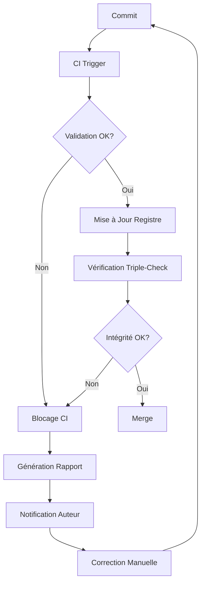

# OBS-0004 : Automatisation des Workflows Documentaires SSOT

## Contexte et Objectifs

### Mission Exploratoire

Cette observation documente l'infrastructure complète d'automatisation des workflows documentaires dans le système SSOT (Single Source of Truth) de Relinium. L'objectif est d'assurer que chaque document exploratoire généré respecte rigoureusement la procédure documentaire établie.

### Objectif Principal

**Production automatique de documents exploratoires conformes au SSOT**, garantissant:
- Création correcte du frontmatter YAML
- Génération et vérification des hashes SHA256
- Inscription automatique au registre documentaire
- Validation continue via CI/CD
- Traçabilité et auditabilité complètes

## Étape 1 : Conformité au Schéma Documentaire SSOT

### 1.1 Schéma Documentaire v1.1

#### Architecture du Schéma

Le schéma `docs/01-genesis/document_schema_v1.1.json` définit la structure canonique des métadonnées:

**Champs Obligatoires:**
- `id`: Identifiant unique (format: `TYPE-NNNN` ou `TYPE-NNNN-vX`)
- `type`: Type de document (`ADR`, `RFC`, `OBS`, `POC`, `SPRINT_DOC`)
- `status`: Statut actuel du document
- `date`: Date de création (format ISO 8601: YYYY-MM-DD)

**Champs Recommandés:**
- `author`: Auteur principal ou équipe responsable
- `version`: Version sémantique (SemVer simplifié)
- `id_root`: Identifiant stable de la lignée documentaire

**Champs Optionnels:**
- `tags`: Tags de classification thématique
- `links`: Relations inter-documents (cites, cited_by, supersedes, superseded_by)
- `previous_hash`: Hash SHA256 du document précédent
- `roles`: Rôles multiples (author, reviewers, guardian, approved_by)
- `decision_type`: Nature de la décision (pour ADR)
- `scope`: Domaine d'application
- `pattern`: Intent métier du document

#### Règles de Validation

```json
{
  "required": ["id", "type", "status", "date"],
  "pattern": {
    "id": "^(ADR|RFC|OBS|POC|SPRINT_DOC)-\\d{4}(-v\\d+)?$",
    "id_root": "^(ADR|RFC|OBS|POC|SPRINT_DOC)-\\d{4}$",
    "previous_hash": "^sha256:[a-f0-9]{64}$"
  }
}
```

### 1.2 Script de Validation Automatique

#### validate_frontmatter.py

**Localisation:** `scripts/validate_frontmatter.py`

**Fonctionnalités:**
- Extraction du frontmatter YAML des fichiers Markdown
- Validation contre le schéma JSON via `jsonschema`
- Détection des erreurs de format et champs manquants
- Génération de rapports de validation détaillés
- Support de logs pour audit

**Workflow de Validation:**

```python
1. Scan récursif de docs/
2. Extraction du frontmatter YAML (pattern: ---...---)
3. Validation contre document_schema_v1.json
4. Génération du rapport (valide/invalide)
5. Export des logs pour traçabilité
```

**Usage:**
```bash
python3 scripts/validate_frontmatter.py
# Exit code: 0 (succès) | 1 (erreurs détectées)
```

**Output Standard:**
- Console: Statut par fichier (✅/❌)
- Log: `docs/sprints/SSOT-v1.0/02-evidence/S3_VALIDATION_LOG.txt`
- Statistiques: Taux de conformité global

### 1.3 Processus de Création Documentaire Conforme

#### Template de Frontmatter Minimal

```yaml
---
id: OBS-XXXX
type: OBS
status: En discussion
date: 2025-11-08
author: Nom de l'auteur
version: 1.0.0
tags:
  - tag1
  - tag2
links:
  cites:
    - DOC-REFERENCE-1
id_root: OBS-XXXX
scope: technical
pattern: observation
---
```

#### Checklist de Conformité

- [ ] Frontmatter YAML présent entre `---` délimiteurs
- [ ] Tous les champs obligatoires renseignés
- [ ] Format ID conforme au pattern
- [ ] Date au format ISO 8601
- [ ] Type parmi les valeurs autorisées
- [ ] Références `links.cites` vers documents existants
- [ ] Status approprié au cycle de vie du document

## Étape 2 : Génération des Hashes et Inscription au Registre

### 2.1 Calcul des Hashes SHA256

#### Script generate_registry.py

**Localisation:** `scripts/generate_registry.py`

**Responsabilités:**
- Scan récursif des documents valides dans `docs/`
- Extraction des frontmatters
- Calcul des hashes SHA256 de chaque fichier
- Construction du registre global
- Détection des doublons d'ID
- Génération du graphe de citations

**Algorithme de Hashing:**

```python
def calculate_file_hash(file_path: Path) -> str:
    sha256_hash = hashlib.sha256()
    with open(file_path, 'rb') as f:
        for byte_block in iter(lambda: f.read(4096), b""):
            sha256_hash.update(byte_block)
    return sha256_hash.hexdigest()
```

**Format du Hash:**
```
sha256:3a7bd3e2360a3d29eea436fcfb7e44c735d117c42d1c1835420b6b9942dd4f1b
```

### 2.2 Structure du Registre v1.1

**Localisation:** `docs/_registry/registry_v1.1.yaml`

#### Architecture du Registre

```yaml
metadata:
  version: "1.1.0"
  generated_at: "2025-11-08T12:00:00Z"
  generator: "scripts/generate_registry.py"
  schema: "docs/01-genesis/document_schema_v1.1.json"

summary:
  total_documents: 50
  by_type:
    ADR: 5
    RFC: 8
    OBS: 12
  by_status:
    Accepté: 10
    En discussion: 5

lineages:
  - id_root: "OBS-XXXX"
    versions:
      - id: "OBS-XXXX"
        type: "OBS"
        status: "Ouvert"
        date: "2025-11-08"
        file_path: "docs/observatory/OBS-XXXX.md"
        hash: "sha256:..."
        author: "Auteur"
        version: "1.0.0"
        links:
          cites:
            - "DOC-REF"

pending_migration:
  - id: "LEGACY-DOC"
    file_path: "docs/legacy/doc.md"
    hash: "sha256:..."
    status: "À migrer"
```

### 2.3 Workflow d'Inscription

#### Processus Automatisé

1. **Détection du Nouveau Document**
   - Trigger: Commit Git avec nouveau fichier .md
   - Validation: `validate_frontmatter.py`

2. **Calcul du Hash**
   - SHA256 du contenu complet du fichier
   - Format: `sha256:hexdigest`

3. **Mise à Jour du Registre**
   - Ajout dans `lineages.versions[]`
   - Ou ajout dans `pending_migration[]` si non conforme
   - Mise à jour des statistiques `summary`

4. **Génération du Registre**
   ```bash
   python3 scripts/generate_registry.py
   ```

5. **Vérification de Cohérence**
   ```bash
   python3 scripts/ssot_registry_check.py
   ```

## Étape 3 : Automatisation via CI/CD

### 3.1 GitHub Actions Workflow

**Localisation:** `.github/workflows/validate-frontmatter.yml`

#### Pipeline de Validation

```yaml
name: SSOT Validation

on:
  push:
    paths:
      - 'docs/**/*.md'
  pull_request:
    paths:
      - 'docs/**/*.md'

jobs:
  validate:
    runs-on: ubuntu-latest
    steps:
      - uses: actions/checkout@v4
      
      - name: Setup Python
        uses: actions/setup-python@v4
        with:
          python-version: '3.10'
      
      - name: Install Dependencies
        run: |
          pip install jsonschema pyyaml
      
      - name: Validate Frontmatter
        run: |
          python3 scripts/validate_frontmatter.py
      
      - name: Check Registry Integrity
        run: |
          python3 scripts/ssot_registry_check.py --ci
      
      - name: Verify Hashes
        run: |
          python3 scripts/ssot_hash_check.py
```

### 3.2 Scripts de Vérification Triple-Check

#### ssot_registry_check.py

**Localisation:** `scripts/ssot_registry_check.py`

**Contrôles Effectués:**

1. **Structure du Registre**
   - Format `id_root` valide
   - Format `id` valide et cohérent avec `id_root`
   - Présence et existence de `file_path`
   - Format `previous_hash` si présent
   - Validation du `hash` SHA256

2. **Couverture Documentaire**
   - Tous les fichiers normatifs recensés
   - Présence dans `lineages` ou `pending_migration`
   - Détection des fichiers orphelins

3. **Pending Migration**
   - Vérification des hashes
   - Status présent
   - Cohérence avec les fichiers existants

4. **Entrées Requises**
   - RFC-004 présent
   - OBS-0001, OBS-0002, OBS-0003 présents

**Usage:**
```bash
# Mode standard
python3 scripts/ssot_registry_check.py

# Mode CI (strict)
python3 scripts/ssot_registry_check.py --ci --strict

# Codes de sortie:
# 0 = OK
# 1 = Warnings uniquement
# 2 = Erreurs critiques (bloque CI)
```

#### ssot_hash_check.py

**Localisation:** `scripts/ssot_hash_check.py`

**Vérifications:**
- Recalcul des hashes de tous les fichiers
- Comparaison avec les hashes du registre
- Détection des divergences
- Rapport d'intégrité

### 3.3 Traitement des Erreurs

#### Types d'Erreurs et Actions

| Erreur | Détection | Action Automatique | Notification |
|--------|-----------|-------------------|--------------|
| Frontmatter manquant | `validate_frontmatter.py` | ❌ Blocage CI | Issue GitHub |
| Champ obligatoire absent | Validation schéma | ❌ Blocage CI | Log détaillé |
| Hash divergent | `ssot_hash_check.py` | ⚠️ Warning | Alerte équipe |
| ID en doublon | `generate_registry.py` | ❌ Blocage | Notification |
| Fichier orphelin | `ssot_registry_check.py` | ⚠️ Warning | Rapport |

#### Workflow de Résolution



## Étape 4 : Rôles et Responsabilités

### 4.1 Architecture Agents

#### Agent de Création
**Responsabilité:** Génération des documents exploratoires

**Tâches:**
- Création du frontmatter conforme au schéma v1.1
- Attribution de l'ID unique
- Remplissage des métadonnées obligatoires
- Ajout des liens `cites` pertinents
- Définition du status initial

**Outils:** `document_schema_v1.1.json`, templates

#### Agent de Validation
**Responsabilité:** Vérification de conformité

**Tâches:**
- Exécution de `validate_frontmatter.py`
- Validation contre le schéma JSON
- Vérification des patterns et formats
- Génération des rapports d'erreur

**Outils:** `validate_frontmatter.py`, `jsonschema`

#### Agent de Registre
**Responsabilité:** Gestion du registre documentaire

**Tâches:**
- Exécution de `generate_registry.py`
- Calcul des hashes SHA256
- Mise à jour des lineages
- Gestion du pending_migration
- Détection des doublons

**Outils:** `generate_registry.py`, `ssot_registry_check.py`

#### Agent de Vérification
**Responsabilité:** Triple-check d'intégrité

**Tâches:**
- Vérification de couverture
- Contrôle des hashes
- Validation des références croisées
- Détection des incohérences

**Outils:** `ssot_registry_check.py`, `ssot_hash_check.py`

#### Agent de Gouvernance
**Responsabilité:** Conformité aux règles SSOT

**Tâches:**
- Validation des ADR/RFC
- Vérification des processus de gouvernance
- Audit des changements
- Application des standards

**Référence:** RFC-004, OBS-GOVERNANCE-0001

#### Agent de Log
**Responsabilité:** Traçabilité des opérations

**Tâches:**
- Enregistrement des événements
- Génération des audits
- Stockage des logs
- Rapports de traçabilité

**Output:** Logs Git, fichiers de validation

### 4.2 Workflows Collaboratifs

```
User Request → Agent Création → Document Draft
                ↓
           Validation Agent → Schema Check
                ↓
           {Valid?}
                ↓ Yes
           Registre Agent → Hash Calculation
                ↓
           Registry Update → Triple-Check
                ↓
           {Integrity OK?}
                ↓ Yes
           Commit GPG Signé → Git History
                ↓
           Gouvernance Agent → Compliance Check
                ↓
           Log Agent → Audit Trail
```

## Étape 5 : Sécurité et Traçabilité

### 5.1 Commits Signés GPG

#### Configuration Requise

```bash
# Configuration Git
git config --global user.signingkey YOUR_GPG_KEY_ID
git config --global commit.gpgsign true

# Vérification des signatures
git log --show-signature
```

#### Processus de Signature

1. **Génération de Clé GPG**
   ```bash
   gpg --full-generate-key
   gpg --list-secret-keys --keyid-format=long
   ```

2. **Configuration GitHub**
   - Ajout de la clé publique GPG au compte GitHub
   - Activation de la vigilant mode

3. **Commits Automatiques Signés**
   - Tous les commits de mise à jour du registre signés
   - Vérification automatique dans le CI

### 5.2 Audit Trail

#### Sources de Traçabilité

1. **Git History**
   - Commits signés GPG
   - Messages descriptifs
   - Diff complets

2. **Logs de Validation**
   - Fichiers de validation horodatés
   - Rapports de conformité
   - Historique des erreurs

3. **Registre Versionné**
   - Snapshots du registre
   - Manifestes de hashes
   - Progression documentée

4. **CI/CD Logs**
   - GitHub Actions logs
   - Résultats de validation
   - Métriques de conformité

### 5.3 Auditabilité

#### Capacités d'Audit

**Reconstruction Complète:**
- État du SSOT à tout instant via Git
- Traçabilité des changements par commit
- Identification de l'auteur et horodatage

**Vérification d'Intégrité:**
```bash
# Vérifier les hashes d'un snapshot
python3 scripts/audit_verify_hashes.py \
  --manifest docs/sprints/SSOT-v1.1/03-validation/SSOT_V1_1_HASHES.yaml

# Audit complet du registre
python3 scripts/ssot_registry_check.py --strict
```

**Génération de Rapport d'Audit:**
```bash
# Truthkeeper Bundle (snapshot complet)
python3 scripts/build_truthkeeper_bundle.py
# Output: reports/truthkeeper/truthkeeper_bundle_YYYY-vN.tar.gz
```

## Étape 6 : Gaps et Opportunités d'Amélioration

### 6.1 Gaps Identifiés

#### Limitations Actuelles

1. **Automatisation Partielle**
   - Création documentaire reste largement manuelle
   - Pas d'API ou interface pour génération automatique
   - Templates statiques uniquement

2. **Validation Réactive**
   - Validation post-création uniquement
   - Pas de validation en temps réel pendant l'édition
   - Feedback loop retardé

3. **Gestion des Erreurs**
   - Notifications limitées (GitHub issues/logs)
   - Pas de système de retry automatique
   - Résolution manuelle requise

4. **Scalabilité**
   - Scripts Python séquentiels
   - Pas de parallélisation
   - Performance sur large corpus non optimisée

5. **Documentation des Workflows**
   - Procédures dispersées
   - Pas de guide unifié
   - Courbe d'apprentissage élevée

### 6.2 Opportunités d'Amélioration

#### Court Terme (1-3 mois)

**1. Agent UI/API pour Création Documentaire**
```
Objectif: Interface web/CLI pour création guidée
Stack: FastAPI + Frontend Vue.js
Features:
  - Formulaire interactif
  - Validation en temps réel
  - Génération automatique de l'ID
  - Suggestions de liens cites
  - Preview Markdown
```

**2. Pre-commit Hooks**
```bash
# .git/hooks/pre-commit
python3 scripts/validate_frontmatter.py --fast
python3 scripts/ssot_registry_check.py --quick
# Blocage avant commit si erreurs
```

**3. Dashboard de Monitoring**
```
Métriques:
  - Taux de conformité global
  - Documents en pending_migration
  - Erreurs de validation fréquentes
  - Évolution du corpus documentaire
  - Graphe de citations
```

#### Moyen Terme (3-6 mois)

**4. Workflow Automatisé Complet**
```yaml
# Pseudo-workflow
on:
  user_request:
    - agent_creation: générer document draft
    - agent_validation: vérifier conformité
    - agent_registry: calculer hash, inscrire
    - agent_verification: triple-check
    - auto_commit: signature GPG
    - notification: succès/échec
```

**5. Intelligence sur les Citations**
```
Features:
  - Suggestion automatique de documents à citer
  - Détection de liens manquants
  - Graphe de dépendances visuelles
  - Analyse d'impact lors de modifications
```

**6. Tests d'Intégration CI/CD Avancés**
```
Scénarios:
  - Test de charge (1000+ documents)
  - Simulation de conflits
  - Validation de performance
  - Tests de régression
```

#### Long Terme (6-12 mois)

**7. Système d'Event Sourcing**
```
Architecture:
  - Chaque changement = événement
  - Log immuable des opérations
  - Reconstruction d'état à tout instant
  - Réplication distribuée
```

**8. IA Générative pour Documentation**
```
Capacités:
  - Génération de drafts à partir de prompts
  - Résumés automatiques
  - Extraction de métadonnées depuis texte
  - Suggestions de catégorisation
```

**9. Blockchain pour Signatures**
```
Concept:
  - Ancrage des hashes sur blockchain publique
  - Preuve d'existence horodatée
  - Immutabilité renforcée
  - Auditabilité externe
```

### 6.3 Matrice de Priorisation

| Amélioration | Impact | Effort | Priorité | Timeline |
|--------------|--------|--------|----------|----------|
| Agent UI/API | ⭐⭐⭐⭐⭐ | ⭐⭐⭐⭐ | P0 | Q1 2026 |
| Pre-commit Hooks | ⭐⭐⭐⭐ | ⭐⭐ | P0 | Q4 2025 |
| Dashboard | ⭐⭐⭐ | ⭐⭐⭐ | P1 | Q1 2026 |
| Workflow Auto | ⭐⭐⭐⭐⭐ | ⭐⭐⭐⭐⭐ | P0 | Q2 2026 |
| Citations IA | ⭐⭐⭐⭐ | ⭐⭐⭐ | P1 | Q2 2026 |
| Event Sourcing | ⭐⭐⭐⭐⭐ | ⭐⭐⭐⭐⭐ | P2 | Q3 2026 |

## Étape 7 : Recommandations Stratégiques

### 7.1 Principes Directeurs

**1. Automatisation Progressive**
- Ne pas tout automatiser d'un coup
- Valider chaque étape avant de passer à la suivante
- Maintenir la possibilité d'intervention manuelle

**2. Fail-Safe par Défaut**
- Blocage systématique en cas de doute
- Rollback automatique possible
- Logs exhaustifs pour diagnostic

**3. Documentation Continue**
- Chaque automatisation doit être documentée
- Maintenir à jour les guides utilisateur
- Formation des équipes sur les nouveaux outils

### 7.2 Roadmap Recommandée

**Phase 1: Consolidation (Q4 2025)**
- Stabilisation des scripts existants
- Documentation exhaustive des processus
- Formation des contributeurs
- Mise en place des pre-commit hooks

**Phase 2: Interface (Q1-Q2 2026)**
- Développement Agent UI/API
- Dashboard de monitoring
- Amélioration des notifications

**Phase 3: Intelligence (Q2-Q3 2026)**
- Système de suggestions automatiques
- Citations intelligentes
- Métriques avancées

**Phase 4: Architecture Avancée (Q3-Q4 2026)**
- Event sourcing
- Scalabilité horizontale
- Intégrations externes

## Conclusion

### Synthèse

L'infrastructure SSOT de Relinium dispose d'une base solide pour l'automatisation des workflows documentaires:

✅ **Points Forts:**
- Schéma documentaire rigoureux (v1.1)
- Scripts de validation robustes
- CI/CD fonctionnel
- Traçabilité via Git + GPG
- Triple-check d'intégrité

⚠️ **Points d'Attention:**
- Automatisation encore partielle
- Scalabilité à valider sur large corpus
- UX de création documentaire à améliorer
- Documentation des workflows à centraliser

### Prochaines Étapes

1. **Immédiat:**
   - Déployer les pre-commit hooks
   - Compléter la documentation des workflows
   - Former les nouveaux contributeurs

2. **Court Terme (1-3 mois):**
   - Développer l'Agent UI/API
   - Implémenter le dashboard de monitoring
   - Optimiser la performance des scripts

3. **Moyen Terme (3-6 mois):**
   - Workflow automatisé end-to-end
   - Citations intelligentes
   - Tests d'intégration avancés

4. **Long Terme (6-12 mois):**
   - Event sourcing
   - IA générative
   - Architecture distribuée

---

**Document généré dans le cadre d'une mission exploratoire sur l'automatisation des workflows SSOT.**

**Validation:** Ce document suit la procédure documentaire SSOT v1.1 et sera inscrit au registre après validation.
